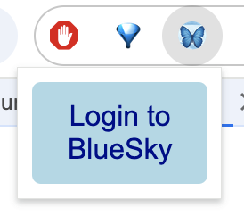
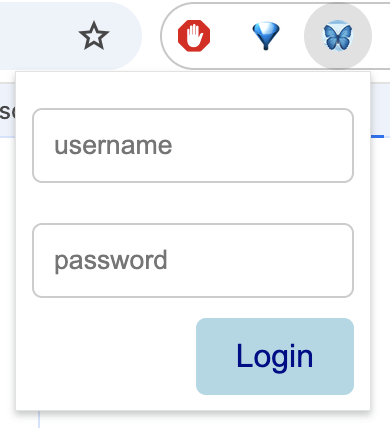
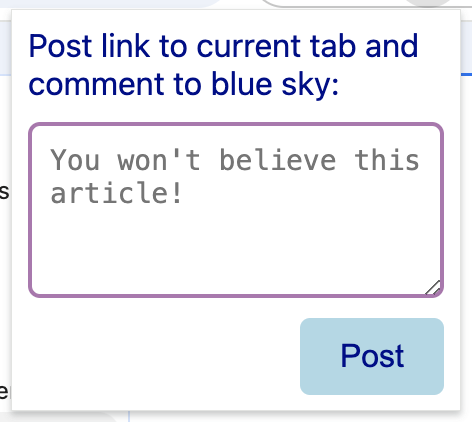
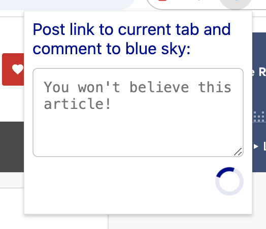
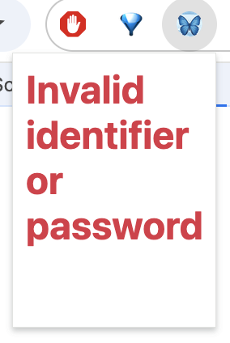

#  Blue Sky Post It

A simple browser extension that allows you to post a link to the current website you are viewing, alongside a short comment dictating your thoughts.

Features:

- Posts link at current tab, along with an optional comment.
- Uses facets to support hyperlinks and hashtags.
- Uses website card embed to embed a card into the post
  - includes title, description, and img (if available)
- Uses chrome.storage to store accessToken more safely than cookies.
- Automatically refreshes token when required.

# Screenshots

### login

### usage

#### how it looks on BlueSky

### success message

### failure message

# How to install

This extension will be submitted for review with both Firefox and Chrome. Once published, the links will be added here. However, there are processes where you can use this repository to install the extension directly. This extension was designed for Chrome manifest v3, but works with Firefox with no changes, other than loading the Firefox compatible manifest file.

To reduce confusion, there are two manifest files titled accordingly. If you want to use firefox, for instance, paste the contents of the `manifest_firefox.json` into `manifest.json` before loading the extension.

## On Chrome

[Loading an unpacked extension in Chrome](https://developer.chrome.com/docs/extensions/get-started/tutorial/hello-world#load-unpacked)

## On Firefox

[Loading a temporary extension in Firefox](https://extensionworkshop.com/documentation/develop/temporary-installation-in-firefox/#:~:text=open%20Firefox,zip%20file)

# Can I improve code?

This was a weekend hobbyist project, but if you really want to improve this extension, please submit a pull request
